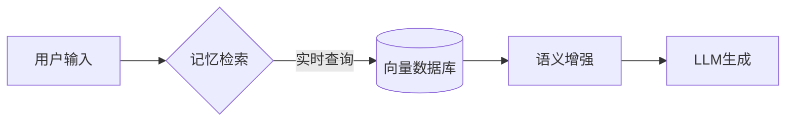

# Hi there 👋 I'm [lxfight]

💻 **Full-Stack Developer** | 🌍 Open Source Contributor | 🚀 Tech Blogger

---

# 🚀 Hi, I'm Lxfight | 

---

## 🌟 项目

### [🔗 Automatic Network Login](https://github.com/lxfight/Automatic-Network-Login)

---

### [🤖 AstrBot Memeify Plugin](https://github.com/lxfight/astrbot_plugin_memeify)

---

### [🧠 Mnemosyne Memory Plugin](https://github.com/lxfight/astrbot_plugin_mnemosyne)

**技术架构：**

---

